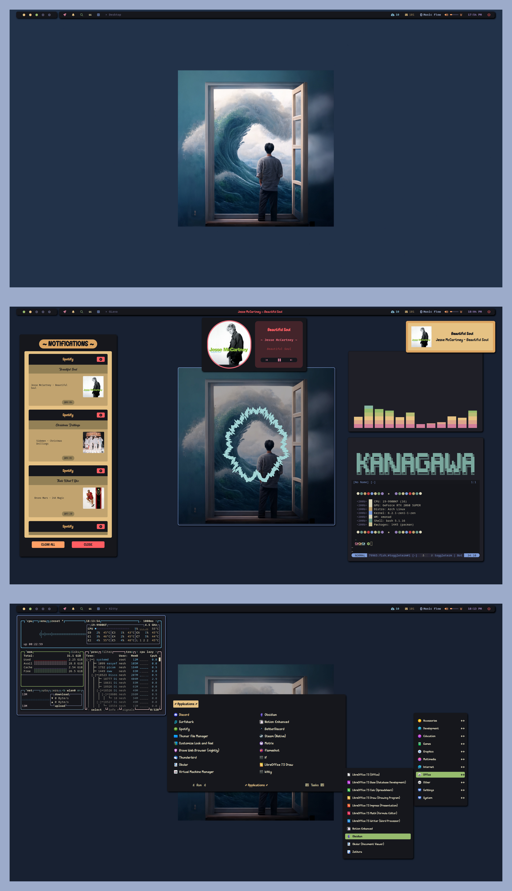

<div align="center">

<h1 align="center">XMonad Starter Kit</h1>

<p align="center">  </p>

<a href="https://github.com/NeshHari/XMonad/stargazers"></a>

<a href="https://github.com/NeshHari/XMonad/issues"><a>


</div>

<h2 align="center">Ewwification (Kanagawa)</h2>



## Tool Overview

- **WM**: [xmonad](https://github.com/xmonad/xmonad)
  - **Extensions**: [xmonad-contrib](https://github.com/xmonad/xmonad-contrib)
- **OS**: [Arch Linux](https://archlinux.org/)
- **Compositior**: [picom-pjulius-git](https://github.com/pijulius/picom)
- **Shell**: [fish](https://wiki.archlinux.org/title/fish)
  - **Plugin Manager**: [fisher](https://github.com/jorgebucaran/fisher)
- **Terminal**: [kitty](https://github.com/kovidgoyal/kitty/)
- **Editor**: [Neovim](https://github.com/neovim/neovim/)
  - **Plugin Manager**: [lazy](https://github.com/folke/lazy.nvim)
- **File Manager**: [Thunar](https://git.xfce.org/xfce/thunar/)
- **Launcher**: [Rofi](https://github.com/davatorium/rofi/) + [jgmenu](https://github.com/jgmenu/jgmenu)
- **Multipurpose**: [eww](https://github.com/elkowar/eww)
- **Browser**: [Brave Nightly](https://aur.archlinux.org/packages/brave-nightly-bin)

## Installation Guidelines

**IMPORTANT**: Please manually install the [additional fonts](#additional-fonts) and run `autorandr --save single` for polybar-based modules to appear. The latter is mandatory since polybar launch is integrated with hotplugging support.

### Automatic Installation (Arch Linux)

_This [setup script](./setup.sh) is offered as a convenience, but its use is at your own discretion (**unstable**). Manual installation is recommended for a safer and more controlled process, as it eliminates the risk of accidental overwrites or incongruous symlinks. As the author, I suggest manual installations to better respect the user's file structure. Please review before use._

```fish
cd ~
wget https://raw.githubusercontent.com/NeshHari/XMonad/kanagawa/setup.sh
bash setup.sh
```

### Dependencies for Manual Installation

_Note: Paru is interchangeable with any AUR helper_

```fish
paru -Syu alacritty autorandr bat cava dunst eww-git fd feh fish fzf ghc ghcup-hs-bin git glava haskell-utf8-string haskell-x11 jgmenu kitty kora-icon-theme lazygit libnotify lxappearance neovim nodejs npm polybar picom-pijulius-git playerctl python-pip rofi stack starship stow ttf-firacode-nerd ttf-font-awesome ttf-jetbrains-mono-nerd unclutter wmctrl xcape xdo xorg-xinit xorg-xmessage xorg-xmodmap xorg-xsetroot zoxide
```

_Note: Polybar will not automatically launch after installation. This is expected behavior. The [polybar launch script](./polybar/.config/polybar/startup.sh) is deliberately tied to autorandr, which is used for hot-plugging. Refer to the section on MyRescreen.hs to see how they all come together._

### Additional Fonts

- [Vanilla Caramel](https://www.dafont.com/vanilla-caramel.font)
- [Cream Cake](https://www.dafont.com/cream-cake.font)
- [Sugar Snow](https://www.dafont.com/sugar-snow.font) -- _Optional_
- [Purple Smile](https://www.dafont.com/purple-smile.font) -- _Optional_

_Note: Downloaded fonts should be placed in ~/.local/share/fonts, before running fc-cache -f -v to update the font cache._

### TUI/CLI Steps

_Note: Avoid using "stow \*\" unless on a fresh install. By default, measures are
in place so that you do not accidentally overwrite existing configurations.
I suggest manually copying configurations to the pertinent directory,
or selectively stowing certain directories (e.g. stow fish)
whilst in the root of the cloned folder._

```fish
git clone -b kanagawa https://github.com/NeshHari/XMonad.git
mv XMonad starter_kit_dots
cd starter_kit_dots
rm README.md setup.sh
stow *
cd ~/.config/xmonad
rm -r xmonad xmonad-contrib
git clone https://github.com/xmonad/xmonad.git
git clone https://github.com/xmonad/xmonad-contrib.git
stack init
stack install
sudo ln -s ~/.local/bin/xmonad /usr/bin
xmonad --recompile && xmonad --restart
```

### Wallpaper

Current: [AI Generated](./wallpapers/wallpapers/kanagawa_custom.png)

_You may change the path to your wallpaper in ~/.config/xmonad/lib/Custom/MyStartupApps.hs_

### Cursor

You may optionally install a custom cursor theme such as [Oreo](https://aur.archlinux.org/packages/oreo-cursors-git).
Once installed, the new cursor can be set with lxappearance.

### Spotify (WIP - DO NOT USE)

You may use the [official package](https://aur.archlinux.org/packages/spotify)
or [Flatpak](https://flathub.org/apps/details/com.spotify.Client) to get spotify.

```fish
flatpak install flathub com.spotify.Client

flatpak run com.spotify.Client
```

To integrate with polybar and avoid the traceback error, you may need to run the following command:

```fish
pip install dbus-python
```

Additionally for non-eww based configurations, to ensure polybar (main-middle) launches only when spotify is used and closes when it is not, please modify the desktop entry:

```shell
# PATH: ~/.local/share/applications/spotify.desktop (copy and modify /usr/share/applications/spotify.desktop so it persist after updates)

[Desktop Entry]
Type=Application
Name=Spotify
...
Exec=/home/myusername/.config/polybar/scripts/poly_spoti.sh
...
```

_Note: Configurations using [Spicetify](https://aur.archlinux.org/packages/spicetify-cli) are available [here](./spicetify/.config/spicetify/Themes/darkarts/) and [here](./spicetify/.config/spicetify/config-xput.ini) but require manual configuration on your end. Refer to the [official docs](https://spicetify.app/docs/getting-started) for more information._

### GTK

For GTK applications, open lxappearance and select the Catppuccin theme of choice. In the Widget section, set the default font to FiraCode Nerd Font. In the Icon Theme section, select Kora Grey.

### Discord (WIP - DO NOT USE)

Install [betterdiscord](https://aur.archlinux.org/packages/betterdiscord-installer) and inject the [CSS](./betterdiscord/darkarts_discord.css).

### Neovim

Launch Neovim and let it do its thing :) Watch out for those LSP/Treesitter prompts, and install what you need automatically.

### Pacman Command Aliases

Fish aliases such as "pacsi" and "parusi" help you fuzzy find official and AUR packages respectively with a preview panel consisting of all necessary information, right in your terminal. You can multi select or toggle select packages my marking or unmarking them using Tab. Likewise, you can remove existing packages in your system using "pacrem". Lastly, "pacupd" runs 'sudo pacman -Syu'.
